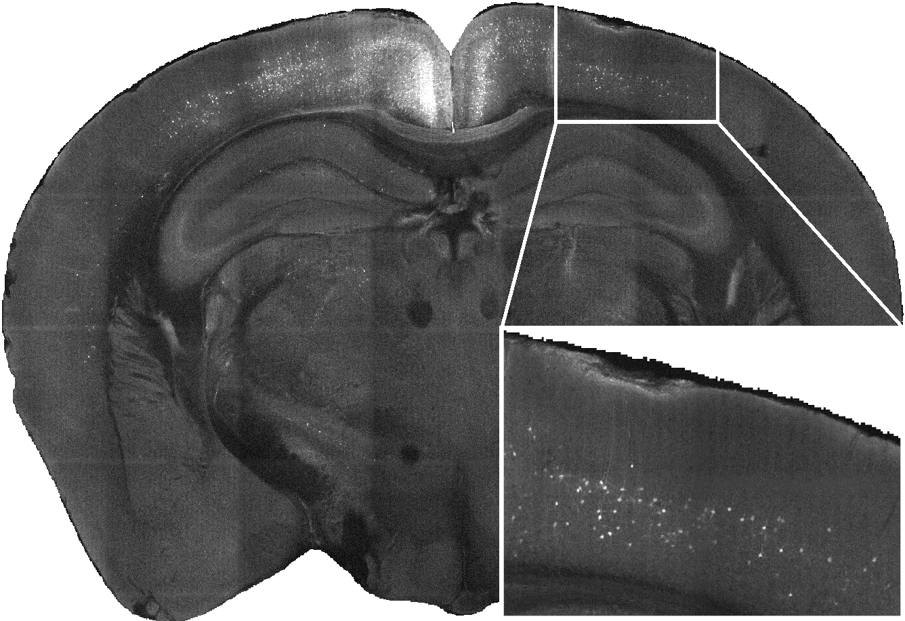
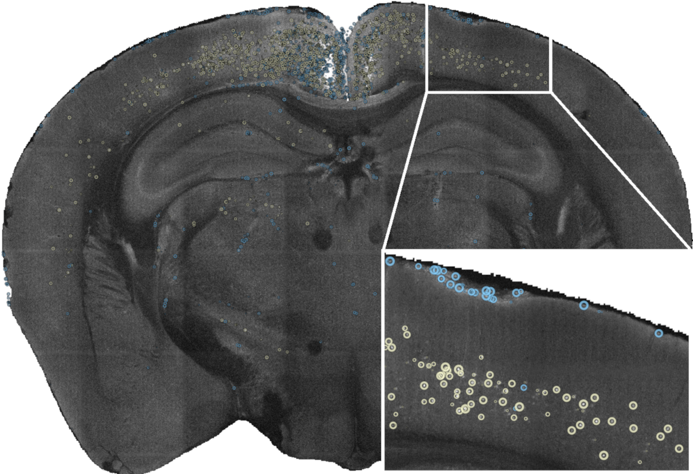
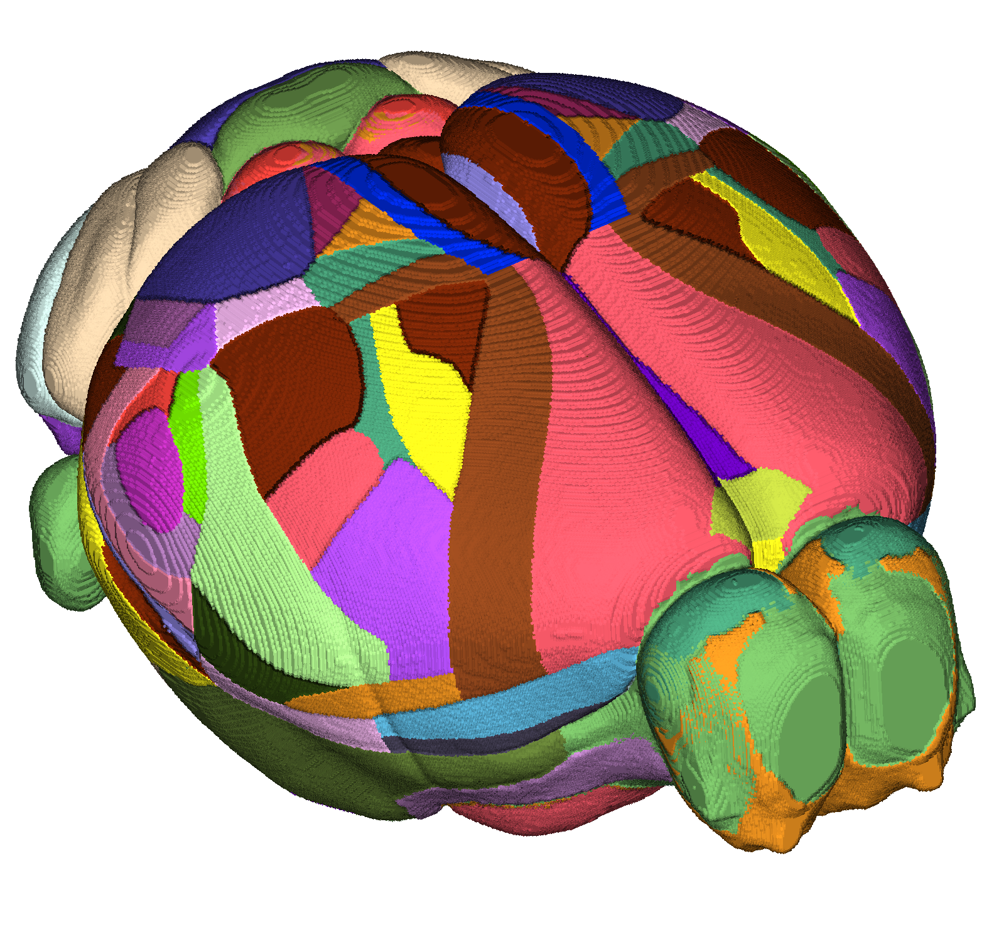

## Whole-brain microscopy {background-color="black"}
{.nostretch fig-align="center" width=62%}

## Whole-brain microscopy {background-color="black"}
{.nostretch fig-align="center" width=62%}


## 3D cell detection
{.nostretch fig-align="center" width="70%"}


## 3D cell detection
{.nostretch fig-align="center" width="70%"}

## Brain atlases
{fig-align="center" }


## Atlas registration

{.nostretch fig-align="center" width="70%"}


## Quantification {.smaller}

```{=html}
<style>
.tight-table table { width: auto !important; margin: 0 auto; }
.tight-table th, .tight-table td { white-space: nowrap; padding: 0.1em 0.10em; }
</style>
```

::: {.tight-table style="font-size: 0.6em"}
| Structure Name | Left Cells | Right Cells | Total Cells | Left Cells/mm³ | Right Cells/mm³ |
|---|---:|---:|---:|---:|---:|
| Primary visual area, layer 2/3 | 964 | 1 | 965 | 927 | 1 |
| Primary visual area, layer 5 | 644 | 6 | 650 | 669 | 6 |
| Dorsal part of the lateral geniculate complex, core | 371 | 0 | 371 | 1481 | 0 |
| Lateral posterior nucleus of the thalamus | 240 | 0 | 240 | 320 | 0 |
| Primary visual area, layer 4 | 207 | 0 | 207 | 349 | 0 |
| Retrosplenial area, ventral part, layer 5 | 162 | 0 | 162 | 182 | 0 |
| Dorsal part of the lateral geniculate complex, shell | 122 | 0 | 122 | 1007 | 0 |
| Lateral dorsal nucleus of thalamus | 121 | 1 | 122 | 227 | 2 |
| Retrosplenial area, dorsal part, layer 5 | 110 | 0 | 110 | 180 | 0 |
| Retrosplenial area, dorsal part, layer 6a | 89 | 0 | 89 | 195 | 0 |
| Laterointermediate area, layer 5 | 53 | 0 | 53 | 621 | 0 |
| Anterolateral visual area, layer 5 | 50 | 1 | 51 | 420 | 8 |
| Primary visual area, layer 6a | 48 | 3 | 51 | 73 | 4 |
| Retrosplenial area, ventral part, layer 6a | 49 | 0 | 49 | 128 | 0 |
:::


## BrainGlobe
{fig-align="center" .nostretch width="70%"}
