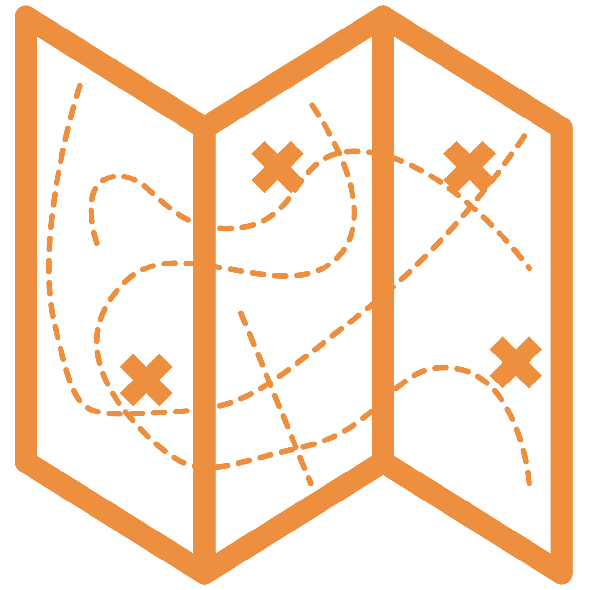
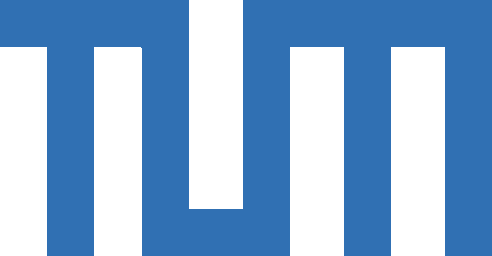
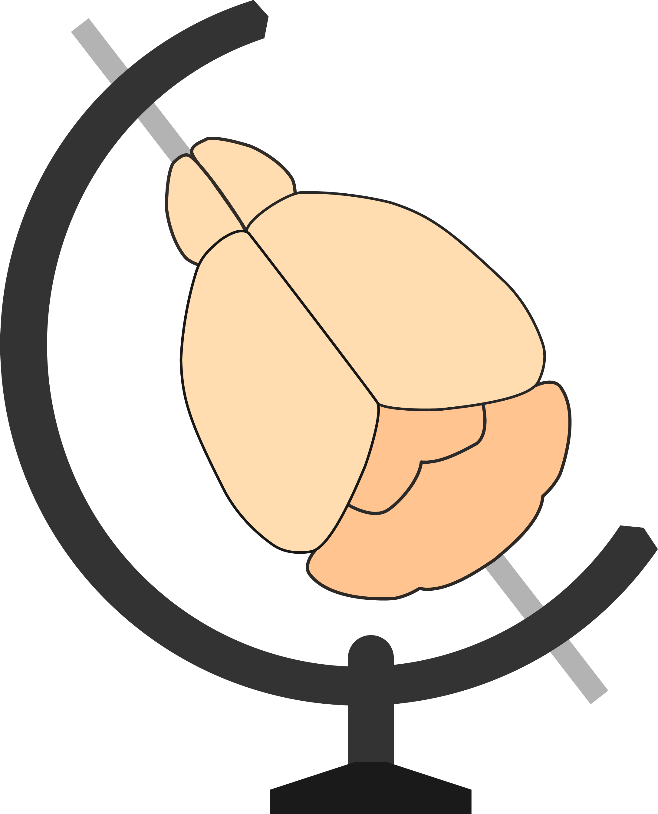

## Serial two-photon tomography {background-color="black"}
{.nostretch fig-align="center" width=62%}

## Serial two-photon tomography {background-color="black"}
{.nostretch fig-align="center" width=62%}

## Whole-brain registration

### [`brainreg`](https://github.com/brainglobe/brainreg)

{.absolute .nostretch top="20%" width="90%" left="5%"}

{.absolute .nostretch top="4%" width="10%" right="0%"}

::: {style="background: #ffffff; width: 15%; height: 65%; margin: 0px; position: absolute; top: 23%; right: 6%"}
:::

::: {.absolute top="32%" left="79%" style="font-size: 0.7em;"}
Allen Mouse 
Brain Atlas
:::

::: {.absolute top="65%" left="79%" style="font-size: 0.7em;"}
Enhanced and 
Unified Mouse 
Brain Atlas
:::

::: {.absolute right="0%" bottom="0%" style="text-align: right; font-size: 0.4em;"}
Christian Niedwork  Charly Rousseau  Adam Tyson
:::

::: footer
[Tyson, A. L. et al. (2022) “Accurate determination of marker location within whole-brain microscopy images” Sci Rep, 12, 867](https://doi.org/10.1038/s41598-021-04676-9)
:::
## 3D cell detection

### [`cellfinder`](https://github.com/brainglobe/cellfinder)

{.nostretch fig-align="center" width="70%"}

::: {.absolute right="0%" bottom="0%" style="text-align: right; font-size: 0.4em;"}
Christian Niedwork  Charly Rousseau  Adam Tyson
:::

::: footer
[Tyson, A. L. et al. (2021) “A deep learning algorithm for 3D cell detection in whole mouse brain image datasets" PLoS Comp Biol 17(5): e1009074.](https://doi.org/10.1371/journal.pcbi.1009074)
:::

## 3D cell detection

### [`cellfinder`](https://github.com/brainglobe/cellfinder)

{.nostretch fig-align="center" width="70%"}

::: {.absolute right="0%" bottom="0%" style="text-align: right; font-size: 0.4em;"}
Christian Niedwork  Charly Rousseau  Adam Tyson
:::

::: footer
[Tyson, A. L. et al. (2021) “A deep learning algorithm for 3D cell detection in whole mouse brain image datasets" PLoS Comp Biol 17(5): e1009074.](https://doi.org/10.1371/journal.pcbi.1009074)
:::

## 3D cell detection

### [`brainmapper`](https://github.com/brainglobe/brainglobe-workflows)

{.nostretch fig-align="center" width="70%"}

{.absolute .nostretch top="4%" width="10%" right="0%"}

::: {.absolute right="0%" bottom="0%" style="text-align: right; font-size: 0.4em;"}
Christian Niedwork  Charly Rousseau  Adam Tyson
:::

::: footer
[Tyson, A. L. et al. (2021) “A deep learning algorithm for 3D cell detection in whole mouse brain image datasets" PLoS Comp Biol 17(5): e1009074.](https://doi.org/10.1371/journal.pcbi.1009074)
:::

## 3D cell detection{.smaller}
::: {style="font-size: 0.5em"}
| Structure Name | Left Cells | Right Cells | Total Cells | Left Vol (mm³) | Right Vol (mm³) | Total Vol (mm³) | Left Cells/mm³ | Right Cells/mm³ |
|---|---:|---:|---:|---:|---:|---:|---:|---:|
| Primary visual area, layer 2/3 | 964 | 1 | 965 | 1.0397 | 1.2568 | 2.2964 | 927.21 | 0.80 |
| Primary visual area, layer 5 | 644 | 6 | 650 | 0.9626 | 1.0232 | 1.9858 | 669.04 | 5.86 |
| Dorsal part of the lateral geniculate complex, core | 371 | 0 | 371 | 0.2506 | 0.2318 | 0.4824 | 1480.52 | 0.00 |
| Lateral posterior nucleus of the thalamus | 240 | 0 | 240 | 0.7498 | 0.7524 | 1.5022 | 320.10 | 0.00 |
| Primary visual area, layer 4 | 207 | 0 | 207 | 0.5938 | 0.6842 | 1.2780 | 348.59 | 0.00 |
| Retrosplenial area, ventral part, layer 5 | 162 | 0 | 162 | 0.8891 | 0.8820 | 1.7711 | 182.22 | 0.00 |
| Dorsal part of the lateral geniculate complex, shell | 122 | 0 | 122 | 0.1211 | 0.1166 | 0.2377 | 1007.10 | 0.00 |
| Lateral dorsal nucleus of thalamus | 121 | 1 | 122 | 0.5330 | 0.5431 | 1.0761 | 227.01 | 1.84 |
| Retrosplenial area, dorsal part, layer 5 | 110 | 0 | 110 | 0.6112 | 0.6247 | 1.2358 | 179.98 | 0.00 |
:::
{.absolute .nostretch top="4%" width="10%" right="0%"}

::: footer
[Tyson, A. L. et al. (2021) “A deep learning algorithm for 3D cell detection in whole mouse brain image datasets" PLoS Comp Biol 17(5): e1009074.](https://doi.org/10.1371/journal.pcbi.1009074)
:::

## 3D atlases
::: {.fragment}
{.absolute .nostretch top="30%" left="0%" width="50%" loop="true" controls="false" autoplay="true" muted="true"}
:::

::: {.fragment}
{.absolute .nostretch top="24%" right="9%" width="37%"}
:::
## BrainGlobe atlases

### [brainglobe-atlasapi](https://github.com/brainglobe/brainglobe-atlasapi)

{fig-align="center" .nostretch width="65%"}

::: {.absolute right="0%" bottom="0%" style="text-align: right; font-size: 0.4em;"}
Luigi Petrucco   Federico Claudi   Adam Tyson
:::

## BrainGlobe Initiative {.smaller}

::: {.columns}
::: {.column width="55%"}
Since 2020:

:::{.incremental}
1. Developed general-purpose tools to help others build interoperable software for computational neuroanatomy.
2. Developed specialist software for specific analysis and visualisation needs.
3. Reduced barriers of entry, and facilitated the building of an ecosystem of computational neuroanatomy tools.
:::

:::
::: {.column width="45%"}

:::
:::

# Acknowledgements {visibility="hidden"}

## Acknowledgements
 

::: {.columns style="font-size: 0.75em; text-align: center;"}
:::: {.column width="33%"}
Federico Claudi Luigi Petrucco Adam Tyson Troy Margrie
::::
:::: {.column width="33%"}
Tiago Branco Ruben Portugues Charly Rousseau Christian Niedworok
::::
:::: {.column width="33%"}
Mateo Vélez-Fort Alessandro Felder Nikoloz Sirmpilatze Simon Weiler
::::
:::

::: {.fragment}
{.absolute height=120px top="52%" left="10%"}
{.absolute height=112px top="76%" right="0%"}
{.absolute height=100px top="52%" right="20%"} 
{.absolute width="78%" top=76% left="0%"}
:::

## {height=70px style="margin-bottom: 0px; margin-top: 0px;"} [Contributors](https://brainglobe.info/people.html)
::: {.columns .gray_link_div style="font-size: 0.4em;"}
:::: {.column width="20%"}
[Christian Niedworok](https://github.com/cniedwor)  
[Charly Rousseau](https://github.com/crousseau)  
[Horst Obenhaus](https://github.com/horsto)  
[Chryssanthi Tsitoura](https://github.com/chrytsi)  
[Sepiedeh Keshavarzi](https://github.com/Sepidak)  
[Mateo Vélez-Fort](https://github.com/velezmat)  
[Stephen Lenzi](https://github.com/stephenlenzi)  
[Rob Campbell](https://github.com/raacampbell)  
[Alessandro Felder](https://github.com/alessandrofelder)  
[Federico Claudi](https://github.com/FedeClaudi)  
[Luigi Petrucco](https://github.com/vigji)  
[Adam Tyson](https://github.com/adamltyson)  
[Troy Margrie](https://github.com/troymargrie)  
[Tiago Branco](https://github.com/ineuron)  
[Ruben Portugues](https://github.com/portugueslab)  
[Joe Ziminski](https://github.com/JoeZiminski)  
[Sofia Miñano](https://github.com/sfmig)  
[Niko Sirmpilatze](https://github.com/niksirbi)  
[Nicholas Del Grosso](https://github.com/nickdelgrosso)  
[Laura Porta](https://github.com/lauraporta)  
[Lee Cossell](https://github.com/lcossell)  
[Antonin Blot](https://github.com/ablot)  
[David Pérez-Suárez](https://github.com/dpshelio)  
[David Stansby](https://github.com/dstansby)  
[Will Graham](https://github.com/willGraham01)  
[Patrick Roddy](https://github.com/paddyroddy)
::::

:::: {.column width="20%"}
[Adrien Berchet](https://github.com/adrien-berchet)  
[Mathieu Bourdenx](https://github.com/MathieuBo)  
[bkntr](https://github.com/bkntr)  
[NovaFae](https://github.com/novafae)  
[David Young](https://github.com/yoda-vid)  
[Sam Clothier](https://github.com/samclothier)  
[Gubra-ApS](https://github.com/Gubra-ApS)  
[Kailyn Fields](https://github.com/kailynkfields)  
[ramroomh](https://github.com/ramroomh)  
[Samuel Diebolt](https://github.com/sdiebolt)  
[Chris Roat](https://github.com/chrisroat)  
[Oren Amsalem](https://github.com/orena1)  
[kclamar](https://github.com/kclamar)  
[Draga Doncila Pop](https://github.com/DragaDoncila)  
[juanma9613](https://github.com/juanma9613)  
[Jules Scholler](https://github.com/JulesScholler)  
[Iaroslavna Vasylieva](https://github.com/noisysky)  
[Nicolas Peschke](https://github.com/npeschke)  
[Justin Kiggins](https://github.com/neuromusic)  
[Peter Sobolewski](https://github.com/psobolewskiPhD)  
[Simão Bolota](https://github.com/SimaoBolota-MetaCell)  
[chili-chiu](https://github.com/chili-chiu)  
[jaimergp](https://github.com/jaimergp)  
[Sebastian Lammers](https://github.com/seblammers)  
[Matt Colligan](https://github.com/m-col)  
[Paul Brodersen](https://github.com/paulbrodersen)
::::

:::: {.column width="20%"}
[Carter Peene](https://github.com/rcpeene)  
[francesshei](https://github.com/francesshei)  
[Sean Martin](https://github.com/seankmartin)  
[Ben Dichter](https://github.com/bendichter)  
[4iar](https://github.com/4iar)  
[Marco Musy](https://github.com/marcomusy)  
[Anna Medyukhina](https://github.com/amedyukhina)  
[stegiopast](https://github.com/stegiopast)  
[EmanPaoli](https://github.com/EmanPaoli)  
[lidakanari](https://github.com/lidakanari)  
[Alexis Arnaudon](https://github.com/arnaudon)  
[Ziyang Liu](https://github.com/liu-ziyang)  
[Philip Shamash](https://github.com/philshams)  
[koushik-ms](https://github.com/koushik-ms)  
[Harald Reingruber](https://github.com/haraldreingruber)  
[Emily Jane Dennis](https://github.com/emilyjanedennis)  
[Peak](https://github.com/pattarika)  
[Maximilian Blacher](https://github.com/3ng7n33r)  
[Hernando Martinez Vergara](https://github.com/HernandoMV)  
[Estelle](https://github.com/enassar)  
[nicole-vissers](https://github.com/nicole-vissers)  
[GD](https://github.com/GDoumou)  
[Michael Kunst](https://github.com/mkunst23)  
[Estelle Nassar](https://github.com/estellenassar)  
[Sara Mederos](https://github.com/SaraMederos)  
[Igor Tatarnikov](https://github.com/IgorTatarnikov)
::::

:::: {.column width="20%"}
[Viktor Plattner](https://github.com/viktorpm)  
[Carlo Castoldi](https://github.com/carlocastoldi)  
[Jingjie Li](https://github.com/jingjie-li)  
[Guillaume Le Goc](https://github.com/GuillaumeLeGoc)  
[Harry Carey](https://github.com/PolarBean)  
[Matt Einhorn](https://github.com/matham)  
[Kimberly Meechan](https://github.com/K-Meech)  
[Robert Kozol](https://github.com/Robkozol)  
[Roberto](https://github.com/RobertoDF)  
[Axel Bisi](https://github.com/abisi)  
[Jung Woo Kim](https://github.com/kjungwoo5)  
[Saima Abdus](https://github.com/saimaabdus19)  
[Saarah Hussain](https://github.com/saarah815/)  
[Sacha Hadaway-Andreae](https://github.com/sacha091)  
[Presa](https://github.com/zenWai)  
[Henry Crosswell](https://github.com/HenryCrosswell)  
[Nischit Kumar](https://github.com/nischitkumar)  
[Kirato Yoshihara](https://github.com/kira1228)  
[Leonard Schwigon](https://orcid.org/0009-0004-1453-2638)  
[Dinora Abdulazhanova](https://uol.de/ibu/neurosensorik/team/dinora-abdulazhanova)  
[Katrin Haase](https://orcid.org/0000-0002-1365-2548)  
[Dominik Heyers](https://orcid.org/0000-0002-2831-6985)  
[Isabelle Museliak](https://orcid.org/0000-0001-7242-3123)  
[Henrik Mouritsen](https://orcid.org/0000-0001-7082-4839)  
[Simon Weiler](https://github.com/simonweiler)  
[Stella Prins](https://github.com/stellaprins)
::::

:::: {.column width="20%"}
[Richard Dushime](https://github.com/richarddushime)  
[Miguel Xochicale](https://github.com/mxochicale)  
[M S P](https://github.com/msp99000)  
[Abdul Samad](https://github.com/samadpls)  
[Prisha Sharma](https://github.com/parharti)  
[Farida Yusuf](https://github.com/frdysf)  
[Anshu Saini](https://github.com/0Anshu1)  
[Menna1812](https://github.com/Menna1812)  
[ayush2281](https://github.com/ayush2281)  
[BethCr](https://github.com/BethCr)  
[Swapnaneel Patra](https://github.com/thisisrick25)  
[Xiaoyu Deng](https://github.com/X-Deng)  
[DwarvesEatRocks](https://github.com/DwarvesEatRocks)  
[DPWebster](https://github.com/DPWebster)  
[Conrad](https://github.com/conradRz)  
[pranav33317](https://github.com/pranav33317)  
[Biswanath Saha](https://github.com/Elsword016)  
[Federico F.](https://github.com/Fede2717)  
[Tim Monko](https://github.com/TimMonko)  
[Kaixiang Shuai](https://github.com/Skxsmy)  
[Giulia Paci](https://github.com/giuliapaci)  
[Marco Dalla Vecchia](https://github.com/marcodallavecchia)  
[Pavel Vychyk](https://github.com/p-vychik)  
[Ishrat Zaman](https://github.com/ishratz25)  
[Asma Bashir](https://github.com/DrABashir)  
[Fatma S. Elsharkawy](https://github.com/FatmaElsharkawy)
::::
:::

::: {.footer}
[https://brainglobe.info/people.html](https://brainglobe.info/people.html)
:::
